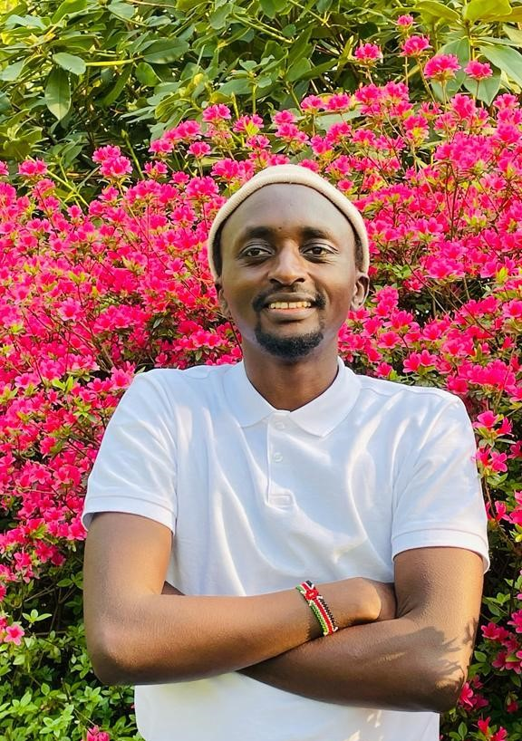

# So who is Brian Munene?

I am 26 years old born and raised in _Kenya_. I moved to _Belgium_ to pursue
further education 🧑🏽‍🎓 and that is where I discovered my passion for **Tech!**.

Curious to learn more about these amazing countries?

- [Kenya](https://en.wikipedia.org/wiki/Kenya)
- [Belgium](https://en.wikipedia.org/wiki/Belgium)

## Lets talk Tech

I am currently learning **Front-End Web Development** at **_HackYourFuture
Belgium_**. Some of our learnings include;

- HTML

- CSS

- JavaScript

- Node.Js

- Git & GitHub

### My other interests

1. Back-End Web Development

2. React

3. ASP.Net

## My motivation?

I hope to contribute in providing Kenyans with **_access_** to crucial
**_information and services_** through **_user-friendly websites and
Web-Apps_**.

The road ahead might be difficult, but as it is commonly said;

> You DON'T come this far, only to come this far! 😉

### Let's connect 📲

[Instagram](https://www.instagram.com/brajah_munene/?hl=en)

### Media files 📷

> A colorful photo of me in Keukenhof Gardens 🌷
